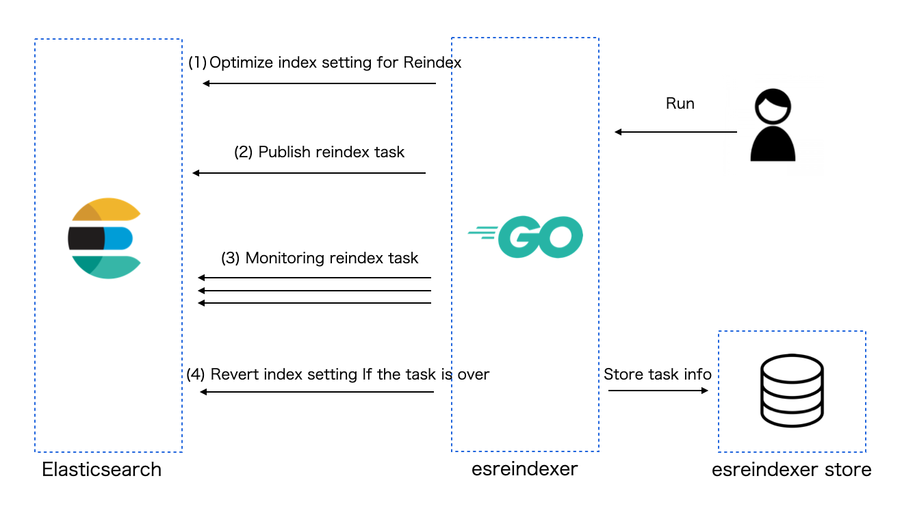

# esreindexer

 [](https://godoc.org/github.com/po3rin/esreindexer)  

⚠️  Under implementation.

Elasticsearch reindex manager optimizing index parameters for reindex.

## Usecase

esreindexer publish reindex tasks after optimizing the index setting to reindex.
Start monitor to check the progress of the task, and if the task is finished, restore the index setting.
The information of the task to be monitored is saved in the esreindexer store. The esreindexer store provides Store interface and the required store implementation is available.



## Supports

### Mode
- [x] Agent mode
- [x] API mode

### Store
- [x] Momory Store
- [ ] MySQL Store
- [ ] etcd Store

### Others
- [ ] WebHook
- [ ] Before Plugin
- [ ] After Plugin

## Using esreindexer as API server

API mode provides reindex API using esreindexer

```sh
// setup Elasticsearch
// example: setting with eskeeper
$ docker-compose up -d
$ eskeeper < testdata/test.eskeeper.ym 
$ ./example/load_testdata.sh

// checks data
// example-v1 has 2 docs
// example-v2 has no docs
$ curl localhost:9200/_cat/indices/example-*
yellow open example-v1 LnXp-WjXQh2iDjyCBd9fxg 2 2 2 0 4.2kb 4.2kb
yellow open example-v2 4pxR7cpvSU-p0mg1vol6-A 2 2 0 0  416b  416b

$ go run ./agent/main.go
$ curl -X POST -H "Content-Type: application/json" -d '{"source": {"index": "example-v1"}, "dest": {"index": "example-v2"}}' localhost:8888/api/v1/reindex 

$ curl localhost:9200/_cat/indices/example-*
yellow open example-v1 LnXp-WjXQh2iDjyCBd9fxg 2 2 2 0 4.2kb 4.2kb
yellow open example-v2 4pxR7cpvSU-p0mg1vol6-A 2 2 2 0 4.1kb 4.1kb
```

### Environment Values

| name                      | description             |
| ------------------------- | ----------------------- |
| ESREINDEXER_LOGGING_LEVEL | reindexer logging level |
| ESREINDEXER_API_PORT      | reindexer API port      |
| ESREINDEXER_ES_ADDRESS    | Elasticsearch address   |
| ESREINDEXER_ES_USER       | Elasticsearch user name |
| ESREINDEXER_ES_PASS       | Elasticsearch password  |

## Using esreindexer components

Implementation example using esreindexer components is in the [example directory](https://github.com/po3rin/esreindexer/tree/main/example).

```sh
// setup Elasticsearch
// example: setting with eskeeper
$ docker-compose up -d
$ eskeeper < testdata/test.eskeeper.ym 
$ ./example/load_testdata.sh

// checks data
// example-v1 has 2 docs
// example-v2 has no docs
$ curl localhost:9200/_cat/indices/example-*
yellow open example-v1 LnXp-WjXQh2iDjyCBd9fxg 2 2 2 0 4.2kb 4.2kb
yellow open example-v2 4pxR7cpvSU-p0mg1vol6-A 2 2 0 0  416b  416b

$ go run ./example/main.go

$ curl localhost:9200/_cat/indices/example-*
yellow open example-v1 LnXp-WjXQh2iDjyCBd9fxg 2 2 2 0 4.2kb 4.2kb
yellow open example-v2 4pxR7cpvSU-p0mg1vol6-A 2 2 2 0 4.1kb 4.1kb
```

